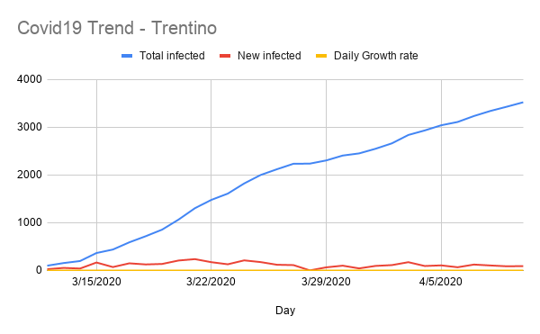

# trento-covid19-trend

Tracking Covid19 trend in Trento Province.

  
  

  
  

## Summary

- [Trend in Trento Province](#Trend-in-Trento-Province)
- [Facts](#facts)
- [Impact on economics](#Impact-on-economics)
- [Impact on health](#Impact-on-health)
- [Solutions](#solutions)
- [Dashboards](#Dashboards)
- [Other lectures](#other-lectures)
- [Software development](#software-development)
- [Deliveries in Trento](#deliveries-in-trento)

## Trend in Trento Province

Data source: [Protezione civile](http://www.protezionecivile.gov.it/media-comunicazione/comunicati-stampa)

<table>
  <thead>
    <tr>
      <td><b>Date</b></td>
      <td><b>Total infected</b></td>
      <td><b>New infected</b></td>
      <td><b>Growth rate</b></td>
      <td><b>Link</b></td>
    </tr>
  </thead>
  <tbody>
    <tr>
      <td>11/03</td>
      <td>74</td>
      <td>?</td>
      <td>?</td>
      <td><a href="http://www.protezionecivile.gov.it/media-comunicazione/comunicati-stampa/-/content-view/view/1228409">Link</a></td>
    </tr>
    <tr>
      <td>12/03</td>
      <td>102</td>
      <td>28</td>
      <td>38%</td>
      <td><a href="http://www.protezionecivile.gov.it/media-comunicazione/comunicati-stampa/-/content-view/view/1229047">Link</a></td>
    </tr>
    <tr>
      <td>13/03</td>
      <td>157</td>
      <td>55</td>
      <td>54%</td>
      <td><a href="http://www.protezionecivile.gov.it/media-comunicazione/comunicati-stampa/-/content-view/view/1226619">Link</a></td>
    </tr>
    <tr>
      <td>14/03</td>
      <td>199</td>
      <td>42</td>
      <td>27%</td>
      <td><a href="http://www.protezionecivile.gov.it/media-comunicazione/comunicati-stampa/-/content-view/view/1230113">Link</a></td>
  </tr>
       <tr>
      <td>15/03</td>
      <td>367</td>
      <td>168</td>
      <td>84%</td>
      <td><a href="http://www.protezionecivile.gov.it/media-comunicazione/comunicati-stampa/dettaglio/-/asset_publisher/default/content/coronavirus-sono-20-603-i-positivi">Link</a></td>
    </tr>
    <tr>
      <td>16/03</td>
      <td>440</td>
      <td>73</td>
      <td>20%</td>
      <td><a href="http://www.ansa.it/trentino/">Link</a></td>
    </tr>
    <tr>
      <td>17/03</td>
      <td>591</td>
      <td>151</td>
      <td>34%</td>
      <td><a href="http://www.ansa.it/trentino/notizie/2020/03/17/coronavirus-fugatti-in-trentino-151-contagi-in-piu-di-ieri_14fd10b7-da3b-4d00-9ac2-50c931969ef7.html">Link</a></td>
    </tr>
    <tr>
      <td>18/03</td>
      <td>719</td>
      <td>128</td>
      <td>22%</td>
      <td><a href="http://www.ansa.it/trentino/notizie/2020/03/18/coronavirus-nuova-vittima-in-trentino-salgono-a-8-i-morti_5b530f89-5f9f-4a16-b879-23bdbdde4771.html">Link</a></td>
    </tr>
     <tr>
      <td>19/03</td>
      <td>857</td>
      <td>138</td>
      <td>19%</td>
      <td><a href="http://www.ansa.it/trentino/notizie/2020/03/19/coronavirus-in-trentino-4-morti-138-contagi_15f224c0-c0ca-490a-9135-f650ee2cfc53.html">Link</a></td>
    </tr>
    <tr>
      <td>20/03</td>
      <td>1067</td>
      <td>210</td>
      <td>25%</td>
      <td><a href="http://www.ansa.it/trentino/notizie/2020/03/20/coronavirus-un-altro-morto-in-trentino-1.067-i-contagiati_dbe9eb2e-a985-46c8-bec0-fc6cda64e198.html">Link</a></td>
    </tr>
    <tr>
      <td>21/03</td>
      <td>1306</td>
      <td>239</td>
      <td>23%</td>
      <td><a href="http://www.ansa.it/trentino/notizie/2020/03/21/coronavirus-in-trentino-15-morti-in-24-ore_f1345c55-8e7a-4ced-9eb8-15f403a43308.html">Link</a></td>
    </tr>
     <tr>
      <td>22/03</td>
      <td>1480</td>
      <td>175</td>
      <td>13%</td>
      <td><a href="http://www.ansa.it/trentino/notizie/2020/03/22/coronavirus-sale-a-35-bilancio-morti-in-trentino_83d52f4d-db4f-4407-8bed-7d49dd824bc2.html">Link</a></td>
    </tr>
     <tr>
      <td>23/03</td>
      <td>1611</td>
      <td>131</td>
      <td>9%</td>
      <td><a href="http://www.ansa.it/trentino/notizie/2020/03/23/coronavirus-altri-6-morti-in-trentino-1.611-contagiati_4ff36bef-7e9c-4486-b72d-7b14dfe026d7.html">Link</a></td>
    </tr>
    <tr>
      <td>24/03</td>
      <td>1824</td>
      <td>213</td>
      <td>13%</td>
      <td><a href="http://www.ansa.it/trentino/notizie/2020/03/24/coronavirus-in-trentino-altri-15-morti-214-contagi_4506ec43-e8ad-432d-90a4-2ab3386ce324.html">Link</a></td>
    </tr>
    <tr>
      <td>25/03</td>
      <td>2001</td>
      <td>177</td>
      <td>10%</td>
      <td><a href="https://www.ansa.it/trentino/notizie/2020/03/25/coronavirus-altri-18-morti-in-trentino-2.001-contagiati_d192b80a-3d29-45da-b76e-f4e158fb3425.html">Link</a></td>
    </tr>
    <tr>
      <td>26/03</td>
      <td>2122</td>
      <td>121</td>
      <td>6%</td>
      <td><a href="https://www.ansa.it/trentino/notizie/2020/03/26/coronavirus-in-trentino-altri-12-morti-121-contagi_2815d59d-2477-4492-9f2b-ea216cedc567.html">Link</a></td>
    </tr>
    <tr>
      <td>27/03</td>
      <td>2236</td>
      <td>114</td>
      <td>6%</td>
      <td><a href="https://www.ansa.it/trentino/notizie/2020/03/27/coronavirus-altri-16-morti-in-trentino-2.236-i-contagiati_643197b5-ce49-42f8-9f27-567b6a048efc.html">Link</a></td>
    </tr>
    <tr>
      <td>28/03</td>
      <td>2239</td>
      <td>3</td>
      <td>0.2%</td>
      <td><a href="http://www.ansa.it/trentino/notizie/2020/03/28/coronavirus-fugatti-altri-18-decessi-numeri-tristi_c5f7e66b-59e3-4c4d-a298-62151ad3cb39.html">Link</a></td>
    </tr>
    <tr>
      <td>29/03</td>
      <td>2306</td>
      <td>67</td>
      <td>3%</td>
      <td><a href="http://www.ansa.it/trentino/notizie/2020/03/29/coronavirus-altri-9-morti-in-trentino-87-i-contagiati_da4944c4-5c03-4433-a3b1-e79c437b6ef0.html">Link</a></td>
    </tr>
     <tr>
      <td>30/03</td>
      <td>2408</td>
      <td>102</td>
      <td>4%</td>
      <td><a href="https://www.ansa.it/trentino/notizie/2020/03/30/coronavirus-in-trentino-altri-18-morti-102-contagi_e459e734-cad2-4e94-9e5e-2152c56cb70e.html">Link</a></td>
    </tr>
     <tr>
      <td>31/03</td>
      <td>2453</td>
      <td>45</td>
      <td>2%</td>
      <td><a href="https://www.ansa.it/trentino/notizie/2020/03/31/coronavirus-in-trentino-altri-17-morti-contagi-in-calo_74dcde29-0bab-4502-b4fa-db493907a3b0.html">Link</a></td>
    </tr>
    <tr>
      <td>1/04</td>
      <td>2550</td>
      <td>97</td>
      <td>4%</td>
      <td><a href="https://www.ansa.it/trentino/notizie/2020/04/01/coronavirus-9-decessi-in-trentino-97-i-contagiati_64085277-fa01-4977-b55f-8f0548eb9539.html">Link</a></td>
    </tr>
    <tr>
      <td>2/04</td>
      <td>2664</td>
      <td>114</td>
      <td>5%</td>
      <td><a href="https://www.ansa.it/trentino/notizie/2020/04/02/coronavirus-in-trentino-altri-14-morti-114-contagi_7880d159-f464-4fa1-820c-2b4bedcd55bf.html">Link</a></td>
    </tr>
     <tr>
      <td>3/04</td>
      <td>2839</td>
      <td>175</td>
      <td>7%</td>
      <td><a href="https://www.ansa.it/trentino/notizie/2020/04/03/coronavirus-altri-17-morti-in-trentino-204-nuovi-contagi_bd98b1e0-e10b-4830-92a9-b7ef4840aa25.html">Link</a></td>
    </tr>
    <tr>
      <td>4/04</td>
      <td>2934</td>
      <td>95</td>
      <td>3.3%</td>
      <td><a href="https://www.ansa.it/trentino/notizie/2020/04/04/coronavirus-altri-6-decessi-in-trentino-95-i-contagiati_8e3757fc-9c1a-4b3c-bbd8-e5f4178ca74a.html">Link</a></td>
    </tr>
    <tr>
      <td>5/04</td>
      <td>3042</td>
      <td>108</td>
      <td>4%</td>
      <td><a href="https://www.ansa.it/trentino/notizie/2020/04/05/coronavirus-altri-7-decessi-in-trentino-58-i-nuovi-contagi_b950a60b-e06b-4735-98c2-8dfd2bbdf52f.html">Link</a></td>
    </tr>
    <tr>
      <td>6/04</td>
      <td>3111</td>
      <td>69</td>
      <td>3%</td>
      <td><a href="https://www.ansa.it/trentino/notizie/2020/04/06/coronavirus-in-trentino-altri-13-morti-69-contagi-in-piu_3d10ac0c-2390-450f-a8d2-af436aefc14c.html">Link</a></td>
    </tr>
    <tr>
      <td>7/04</td>
      <td>3236</td>
      <td>125</td>
      <td>4%</td>
      <td><a href="https://www.ansa.it/trentino/notizie/2020/04/07/coronavirus-altri-14-morti-in-trentino-125-nuovi-contagi_53fc75f0-51f0-4f4f-ac66-79acdc77991e.html">Link</a></td>
    </tr>
    <tr>
      <td>8/04</td>
      <td>3342</td>
      <td>106</td>
      <td>3%</td>
      <td><a href="https://www.ansa.it/trentino/notizie/2020/04/08/coronavirus-altri-11-morti-in-trentino-106-contagi_0e197466-5c0f-42a6-91d2-daf144875002.html">Link</a></td>
    </tr>
    <tr>
      <td>9/04</td>
      <td>3431</td>
      <td>89</td>
      <td>3%</td>
      <td><a href="https://www.ansa.it/trentino/notizie/2020/04/09/coronavirus-13-nuovi-decessi-in-trentino-89-contagiati_08c5e25f-d6fe-4fd3-b7d4-4c917ec128cb.html">Link</a></td>
    </tr>
     <tr>
      <td>10/04</td>
      <td>3524</td>
      <td>93</td>
      <td>3%</td>
      <td><a href="https://www.ansa.it/trentino/notizie/2020/04/10/coronavirus-7-decessi-in-trentino-93-i-contagiati_e3a034ee-53e1-4a3a-a24c-e8257bda9c7e.html">Link</a></td>
    </tr>
     <tr>
      <td>11/04</td>
      <td>3669</td>
      <td>145</td>
      <td>4%</td>
      <td><a href="https://www.ansa.it/trentino/notizie/2020/04/11/coronavirus-altri-9-morti-in-trentino-145-contagi_39600044-a9cc-4187-a927-e2cb75be30a2.html">Link</a></td>
    </tr>
     <tr>
      <td>12/04</td>
      <td></td>
      <td><td>
      <td></td>
      <td><a href="">Link</a></td>
    </tr>
    <tr>
      <td>13/04</td>
      <td></td>
      <td><td>
      <td></td>
      <td><a href="">Link</a></td>
    </tr>
    <tr>
      <td>14/04</td>
      <td></td>
      <td><td>
      <td></td>
      <td><a href="">Link</a></td>
    </tr>
    <tr>
      <td>15/04</td>
      <td></td>
      <td><td>
      <td></td>
      <td><a href="">Link</a></td>
    </tr>
    <tr>
      <td>16/04</td>
      <td></td>
      <td><td>
      <td></td>
      <td><a href="">Link</a></td>
    </tr>
    <tr>
      <td>17/04</td>
      <td></td>
      <td><td>
      <td></td>
      <td><a href="">Link</a></td>
    </tr>
  </tbody>
</table>

## Update on 27/03

- number of new infected per days is decreasing over time. I think we reached the peak, and number of new infected should further decrease on next weeks

## Update on 20/03

- growth during last 3 days in 19%-25%
- **Ansa.it have each day an higher number of infected than Protezione Civile**. The higher number could be due to different way of counting - they start to count +10 infected for each new infected - to take into account the potential and not yet measured spread and try to get a more real number of infected 

## Update on 18/03

- **in the last 3 days growth rate seems stable between 20%-35%** 
- [count by municipality](https://www.giornaletrentino.it/cronaca/coronavirus-mappa-dei-contagi-trento-arco-ledro-e-pergine-le-zone-pi%C3%B9-colpite-1.2296477) - in Trento 118 infected. 38 new infected in 2 days, from 16/03/2020. Growth rate by 46% 

## Update on 16/03

- growth rate back to 20%. No further insights can be derived, given lack of any pattern during recent days
- [count by municipality](https://www.lavocedeltrentino.it/2020/03/17/coronavirus-in-trentino-la-mappa-dei-comuni-interessati/) - 84 infected in Trento

## Update on 15/03

- **growth rate drammatically increases, to 84%**, the highest in recent days. Probably still a result from the time before lockdown, or lockdown not correctly observed or not working correctly in some areas  

## Update on 14/03

- **growth rate decreased from 54% to 27%**. However, it could still increase, due to 2 weeks incubation period, that makes spread measurements uncertain
- because of lockdown (started on March 10th), **growth rate should go to almost 0% on March 24th**
- actual risks not included in the prediction:
  - commuters going back to their city of birth, happening these recent days  
  - people in touch with actual infected, that could get infected  
  - people living in foreign countries that adopted lockdown too late (eg UK, Germany, Spain) and that could travel to Italy

## Facts

**Predictions**

- **in Wuhan, lockdown started when infected people were 500** [Link](https://en.wikipedia.org/wiki/Timeline_of_the_2019%E2%80%9320_coronavirus_pandemic_in_November_2019_%E2%80%93_January_2020#23_January) [Link2](https://www.facebook.com/cristiano.siri/posts/10158326307985763). It was on January 23rd. On March 14th the number grew to about 80.000
- **in Italy, lockdown started when number of infected were 5.883** [Link](http://www.protezionecivile.gov.it/media-comunicazione/comunicati-stampa/-/content-view/view/1225413). It was March 7th. **Governement estimates to reach the peak of 92.000 infected on March 18th** [Link](https://www.ilsole24ore.com/art/coronavirus-governo-stima-92mila-contagi-picco-18-marzo-ADfgS9C). On March 14th number of infected is 17.750. The growth rate of the recent days is about +3.000 infected per day 

**Curiosity**

- [50-75% of infected are asymptomatic](https://www.repubblica.it/salute/medicina-e-ricerca/2020/03/16/news/coronavirus_studio_il_50-75_dei_casi_a_vo_sono_asintomatici_e_molto_contagiosi-251474302/)

## Impact on economics

- [How Covid-19 will impact IT and tech spending for 2020 and beyond](https://www.cloudcomputing-news.net/news/2020/mar/30/covid-19s-impact-on-tech-spending-this-year/)
- [how covid 19 is impacting software development hiring](https://medium.com/coderbyte/how-the-covid-19-pandemic-is-impacting-software-development-hiring-72243f41ac9e)
- [How covid19 is impacting data jobs](https://www.datanami.com/2020/04/03/how-covid-19-is-impacting-the-market-for-data-jobs/) (2020-04-03)
- [Dozens have laid off thousands, slashed costs and changed their businesses to try to survive the pandemic. All that may not work.](https://www.nytimes.com/2020/04/01/technology/virus-start-ups-pummeled-layoffs-unwinding.html?auth=login-facebook)
- (IT) [Famiglie e imprese, per il dopo conterà il digitale](https://roma.corriere.it/notizie/cronaca/20_aprile_04/per-dopocontera-digitale-e19e557a-75d0-11ea-856e-f9aa62c97d7a.shtml?fbclid=IwAR1FuGIKpfpXwbnugA65-da79u3dHQi-jR3WV20_l6l2jDVZpGeBGZOuC1Q&refresh_ce-cp)
- [the ceo playbook for keeping your company alive](https://steveblank.com/2020/04/01/the-ceo-playbook-for-keeping-your-company-alive/)
- [50% of small business gone. Walmart stock is at record high & Amazon is hiring 100k people](https://twitter.com/DanPriceSeattle/status/1241061860960612354) - 20/03/2020
- [Effect of economic crisis on America’s small businesses](https://docs.google.com/presentation/d/1IUTHX2kTagUUV88HUJCkp_P6iZgLCXXVHD9UeOwU_1w/mobilepresent?slide=id.g71b0a47020_30_486) (21/03/2020)
- [How Chinese companies have responded to Coronavirus](https://hbr.org/2020/03/how-chinese-companies-have-responded-to-coronavirus)
- [150 public traded companies have warned investors](https://www.cnbc.com/2020/03/11/coronavirus-at-least-150-companies-have-warned-investors.html)
- [DHL Update (10/03/2020)](https://www.logistics.dhl/content/dam/dhl/global/dhl-global-forwarding/documents/pdf/glo-dgf-statement-corona-virus.pdf)
- [Philips China supply chains recovering from disruption will hit results](https://seekingalpha.com/news/3548538-philips-china-supply-chains-recovering-disruption-will-hit-results)
- [Stop the European Central Bank](https://twitter.com/ThomasPHI2/status/1239953959256829957)
- [Bloomberg / five early warning economic indicators show us virus shock](https://www.bloomberg.com/news/articles/2020-03-14/five-early-warning-economic-indicators-show-u-s-virus-shock?) - 14/03/2020
- [McKinsey Report](https://www.mckinsey.com/~/media/McKinsey/Business%20Functions/Risk/Our%20Insights/COVID%2019%20Implications%20for%20business/COVID-19-Facts-and-Insights-February-28-2020-McKinsey.ashx) - 28/02/2020 
- [Philips - Statement](https://www.philips.com/a-w/about/news/archive/standard/news/articles/2020/20200318-statement-of-philips-ceo-frans-van-houten-on-the-covid-19-outbreak.html) - 18/03/2020
- [DHL - Statement](https://www.logistics.dhl/content/dam/dhl/global/dhl-global-forwarding/documents/pdf/glo-dgf-statement-corona-virus.pdf) - 10/03/2020

## Impact on health

- [How Coronavirus kills](https://www.youtube.com/watch?v=okg7uq_HrhQ)
- [Potential permanent damages after recovery](https://www.businessinsider.com/coronavirus-recovery-damage-lung-function-gasping-air-hong-kong-doctors-2020-3?IR=T)
- [7 importanting things to know about Coronaviruses](https://www.nytimes.com/2020/03/20/opinion/coronavirus-facts.html)

## Solutions

- [Plasma from blood of people that recovered](https://www.globalhealthnow.org/2020-03/covid-19s-stop-gap-solution-until-vaccines-and-antivirals-are-ready)

## Dashboards

- [Sole24 ore - Updated data and map at Italian level](https://lab24.ilsole24ore.com/coronavirus/)
- [WFP - World Food Programme](https://www.arcgis.com/apps/opsdashboard/index.html#/4f74fc222b7041cd9cc3c52e62af1b8c)
- [GediDigital](https://lab.gedidigital.it/gedi-visual/2020/coronavirus-in-italia/)
- [WHO - World wide view](https://experience.arcgis.com/experience/685d0ace521648f8a5beeeee1b9125cd)

## Other lectures

- [Germany low coronavirus mortality rate puzzles experts](https://www.theguardian.com/world/2020/mar/22/germany-low-coronavirus-mortality-rate-puzzles-experts)
- [Bill Gates - AMA about COVID-19](https://www.reddit.com/r/Coronavirus/comments/fksnbf/im_bill_gates_cochair_of_the_bill_melinda_gates/)

## Software development

- [Coronavirus apps translated](./Coronavirus-apps-translated-Connie-Chan.pdf)

## Deliveries in Trento

https://www.notion.so/fcb0273cf5c74b8ca7435d8e1288eb36?v=3de55490066c45f7a97ce5d4ad7f62d6

